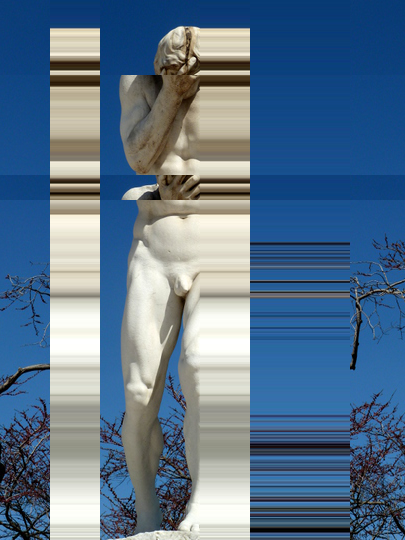
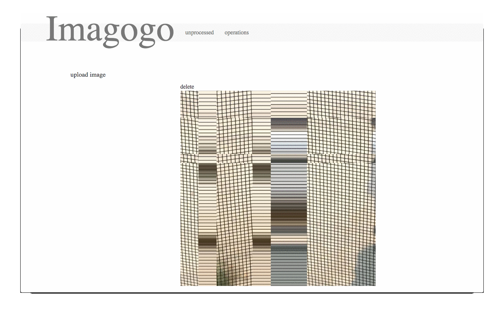

#imagogo
Rails app to upload and process images using [ruby-grid](https://github.com/your/ruby-grid) library (stub).

#sidekiq it

	redis-server /usr/local/etc/redis.conf &
	cd imagogo ; sidekiq
	
		
#how does it work
There are 3 sidekiq workers:

* **OpUploadWorker**: async uploads
* **OpResizeWorker**: async server side img resize (using ImageMagick mini_magick wrapper)
* **OpProcessWorker**: async server side image processing using a predefined template for ruby-grid

When an upload is completed, a default resize is automatically applied.

Processing needs to be manually invoked instead.

Operations status can be monitored too (WARN: failures are not noticed yet, they will stay saved as operations in a running state forever -even if removed from redis queue after 2 attempts- .. )

Note: resize/process workers can be invoked after an Image object creation:

	i = Image.new(local_src: 'public/imgs/face_palm.png')
	
	i.resize # => async call!
	i.process # => BEWARE, won't run if resize is not completed!

#demo

#api (incomplete)
###last op status for image_id
	curl http://{domain:port}/op/{image_id}.json
	
	{
		id: 163,
		operation_type: "process",
		status: "ok"
	}
###..
#todo
* js/redis polling for jobs completion/failure (50%)
* appearance restyle / react.js V substitution
* free parameters customization (or templates) for image processing
* remote URL fetching
* live processing preview
* batch processing
* processing API (10%)

#techs
* ruby 2.2.2
* rails 4+
* postgresql
* redis
* **sidekiq**
* mini_magick
* ruby-grid
* ..

#"I'm worried about performances.."

#license: MIT

Copyright (C) 2015 Giuseppe Lobraico

Permission is hereby granted, free of charge, to any person obtaining a copy of this software and associated documentation files (the "Software"), to deal in the Software without restriction, including without limitation the rights to use, copy, modify, merge, publish, distribute, sublicense, and/or sell copies of the Software, and to permit persons to whom the Software is furnished to do so, subject to the following conditions:

The above copyright notice and this permission notice shall be included in all copies or substantial portions of the Software.

THE SOFTWARE IS PROVIDED "AS IS", WITHOUT WARRANTY OF ANY KIND, EXPRESS OR IMPLIED, INCLUDING BUT NOT LIMITED TO THE WARRANTIES OF MERCHANTABILITY, FITNESS FOR A PARTICULAR PURPOSE AND NONINFRINGEMENT. IN NO EVENT SHALL THE AUTHORS OR COPYRIGHT HOLDERS BE LIABLE FOR ANY CLAIM, DAMAGES OR OTHER LIABILITY, WHETHER IN AN ACTION OF CONTRACT, TORT OR OTHERWISE, ARISING FROM, OUT OF OR IN CONNECTION WITH THE SOFTWARE OR THE USE OR OTHER DEALINGS IN THE SOFTWARE.
